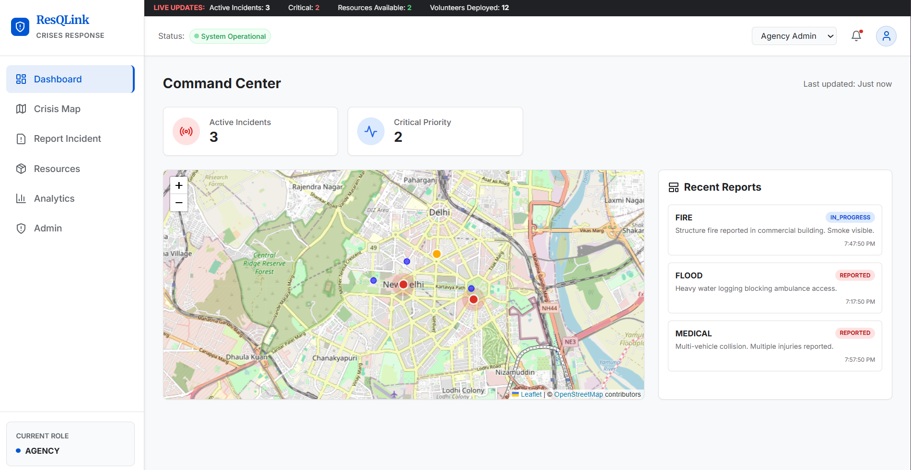

# ResQLink (CrisisConnect)

> **Bridging the gap between distress and relief.**

ResQLink is a centralized, frontend-focused crisis response platform designed to visualize emergencies, resources, and response efforts in a single, unified interface.

[](https://res-q-link-delta.vercel.app/)



## 📋 Executive Summary

In times of crisis, information delay costs lives. ResQLink acts as a “single source of truth” dashboard where:

- **Community members** can report incidents.
- **Volunteers** can identify where help is needed.
- **Agencies** can monitor crisis severity and resource distribution.

This application is a **frontend-first** simulation using local state, ideal for demonstrations and evaluations without backend dependencies.

## 🚀 Key Features

### 🖥️ Incident Command Center

- **Crisis Heatmap**: Interactive map displaying incident clusters with color-coded severity.
- **Live Metrics**: Real-time ticker showing active incidents and resource availability.
- **Visual Status Board**: Kanban-style workflow for managing incident lifecycles.

### 🆘 One-Tap Reporting

- Easy-to-use SOS reporting form.
- Mock GPS location detection.
- Severity triage selection (Critical, High, Medium).

### 📦 Resource Handling

- Inventory tracking for Water, Food, and Medical supplies.
- Volunteer unit status tracking (Deployed/Standby).

### 👥 Role-Based Access

Toggle between three distinct views:

1.  **Civilian View**: Report and view safety map.
2.  **Volunteer View**: Respond to tasks and track progress.
3.  **Agency View**: Full administrative dashboard and analytics.

### 📊 Analytics

- Data visualizations for incident trends and severity distribution.

## 🛠️ Tech Stack

- **Framework**: React.js + Vite
- **Styling**: Tailwind CSS (Custom "Trust & Clarity" Theme)
- **Maps**: Leaflet + React-Leaflet
- **Icons**: Lucide React
- **Charts**: Recharts

## ⚡ Getting Started

### Prerequisites

- Node.js installed

### Installation

1.  **Clone the repository**

    ```bash
    git clone https://github.com/yourusername/resqlink.git
    cd resqlink
    ```

2.  **Install dependencies**

    ```bash
    npm install
    ```

3.  **Start the development server**
    ```bash
    npm run dev
    ```

## 🎨 Design Philosophy

- **Simplicity over complexity**: Critical actions take minimal clicks.
- **Visual Clarity**: Medical Blue (#0056D2) and Signal Red (#D93025) for high contrast and authority.
- **Offline-First Concept**: UI designed to reflect real-world connectivity constraints.

---

_ResQLink demonstrates how thoughtful frontend design can transform crisis response._
